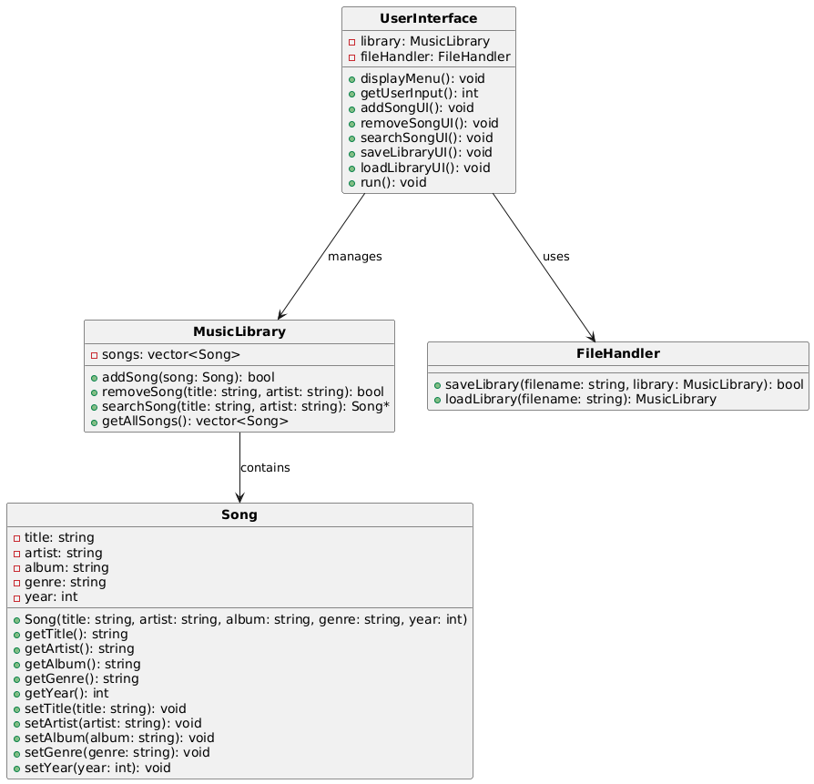
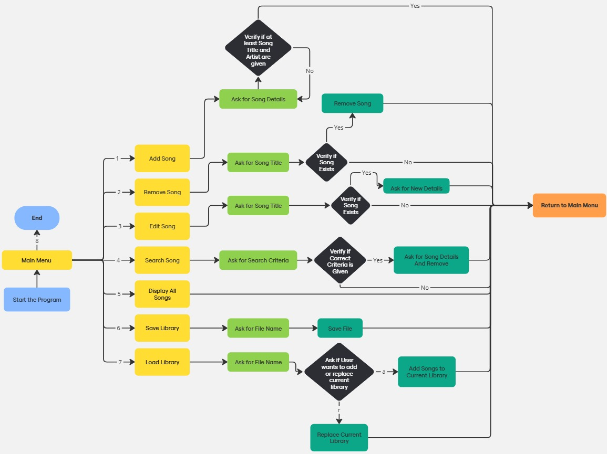
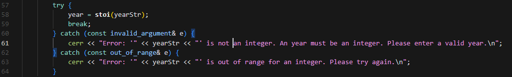
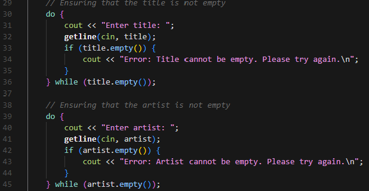
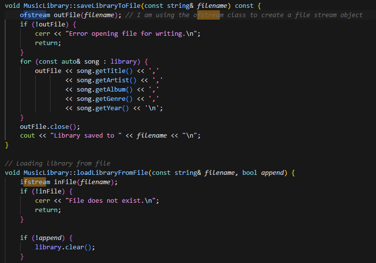
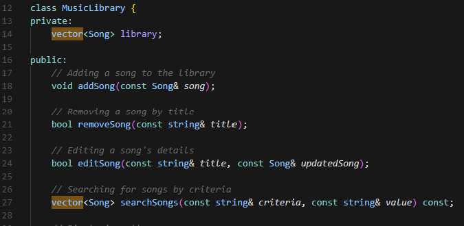
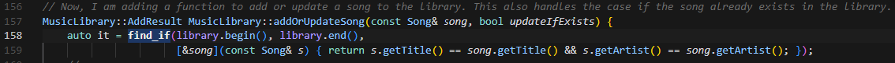
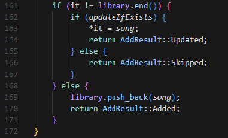
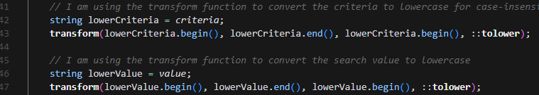

# Report
## Introduction
I have developed a music library management system that allows users to add, remove, and search for songs in the library. Moreover, the program allows users to save and load the music library to a file. The system is designed to be user-friendly and efficient, with a focus on error handling and data validation.  My implementation is a simple console application that allows users to interact with the music library. However, it is to be noted that the program is not perfect and has some limitations. For instance, the program does not have a graphical user interface, and the users have to interact with the program in the console. Also, the program does not have a feature to play songs, which is a common feature in music player software. Hence, this project is strictly a music library management system rather than a streaming service like Spotify or Apple Music. 

## Approach

### General Breakdown of the Program:
The user for my music library management system can be anyone who wants to keep a record of their music collection. For each song, the user can record the song's title, artist, album, genre, and the year the song was released. Ideally, a user should have the song's duration, but I have not included that in the program. My program allows users to add songs to the library, remove songs from the library, and search for a song in the library. The user can also save the music library to a file and load the music library from a file. The program, in turn, has multiple checks in place to ensure that the user inputs are valid. For instance, the program checks if the song already exists in the library before adding it, and it checks if the song exists in the library before removing it. Also, the program checks if the file exists before loading the music library from a file. 

### Used Classes and UML Diagram:
In order to implement the program in a well-structured manner, I have used several classes. The main classes used in the program are `Song`, `MusicLibrary`, `FileHandler`, and `UserInterface`. The `Song` class is used to store the details of a song, such as the song's title, artist, album, genre, and the year the song was released. The `MusicLibrary` class is used to store the songs in the library and to add, remove, and search for songs in the library. The `FileHandler` class is used to save and load the music library to a file. The `UserInterface` class is used to display the menu and to get the user's input.

Below is the UML diagram of the classes used in the program:

## Solution

### Program Structure
The solution is summarized in the diagram attached below in Figure 2. When the program starts, the `UserInterface` class is instantiated and the `mainMenu` method is called. If the user selects '1' as their input, the program asks for the song's title, artist, album, genre, and the year the song was released. The program then creates a `Song` object with the user's input and adds it to the music library. If the song already exists in the library, the program displays an error message and does not add the song to the library.

If the user selects '2' as their input, the program asks for the song's title. The program then removes the song with the given title from the music library. If the song does not exist in the library, the program displays an error message and does not remove the song from the library.

If the user selects '3' as their input, the program asks for the song's title. The program then searches for the song with the given title in the music library. If the song exists in the library, the program asks the user for the new details of the song. The program then updates the song's details in the music library. If the song does not exist in the library, the program displays an error message.

If the user selects '4' as their input, the program asks for the search criteria. The user can search using the title of the song, artist name, album, genre or the year of the song. If the correct search criteria is selected, the program asks for the search term. The program then searches for the song with the given term in the music library. If the song exists in the library, the program displays the song's details. If the song does not exist in the library, the program displays an error message.

If the user selects '5' as their input, the program simply displays the entire music library and then returns to the main menu.

If the user selects '6' as their input, the program asks for the filename. The program then save the music library to the file with the given filename. 

If the user selects '7' as their input, the program asks for the filename. The program then loads the music library from the file with the given filename. If the file does not exist, the program displays an error message.

If the user selects '8' as their input, the program exits.

### Optimizations
I have performed numerous optimizations to ensure that the program is efficient and the user experience is smooth. 

1. Error Handling:
On multiple instances in my code, I have used try-catch blocks to handle errors. For instance, I have used try-catch blocks in the `main.cpp` file in the `getSongDetails` function to handle the `stoi` function. If the user enters a non-integer value, the program throws an error and the user is asked to enter a valid year. 

2. Input Validation:
I have used do-while loops in the `main.cpp` file in the `getSongDetails` function to ensure that the user enters a valid input. For instance, the program asks for the song's title, and the artist. The program then checks if the user inputs are empty. If they are, the program displays an error message and asks for the song's title, and artist again.

3. File Handling:
I have used the `fstream` library to handle the file. The `FileHandler` class has two methods: `loadLibraryFromFile` and `saveLibraryToFile`. The `loadLibraryFromFile` method is used to load the music library from a file using the `ifstream` class. The `saveLibraryToFile` method is used to save the music library to a file using the `ofstream` class. The advantage of using the `fstream` library is that it allows me to handle the file in a more efficient manner.

4. Data Structures:
I have used the `vector` data structure to store the music library. The `vector` data structure is used to store the songs in the library. Vectors are a dynamic array that can change size. This is useful for storing the songs in the library as the library can grow or shrink as the user adds or removes songs.

5. Algorithms:
I have used the `find_if` algorithm to search for a song in the music library. The `find_if` algorithm is used to search for the song with the given title in the music library. If the song exists in the library, the program displays the song's details. If the song does not exist in the library, the program displays an error message.

6. Enum Usage:
Making use ofthe `enum` class to store the result of the `addSong` method, I have implemented another optimization.  The `enum` class has two possible values: `AddResult::SUCCESS` and `AddResult::FAILURE`. The `AddResult::SUCCESS` value is used to store the result of the `addSong` method when the song is added to the music library. The `AddResult::FAILURE` value is used to store the result of the `addSong` method when the song already exists in the music library. 

7. Case-insensitive Searches:
Using the `toLower` function, I convert the search term and the song's title to lowercase. This is used to make the search case-insensitive taking into consideration that a user may neccesarily not know which letter of song title should be capital.

## User Manual

- Start the program and select the desired option from the menu.
- If you select option 1, you will be prompted to enter the details of the song.
- If you select option 2, you will be prompted to enter the title of the song to be removed.
- If you select option 3, you will be prompted to enter the title of the song to be edited.
- If you select option 4, you will be prompted to enter the search criteria and the search term.
- If you select option 5, the program will display the entire music library.
- If you select option 6, you will be prompted to enter the filename to save the music library.
- If you select option 7, you will be prompted to enter the filename to load the music library. The program will ask the user if they want to add to the existing library or replace it.
- If you select option 8, the program will end.

## References:
https://www.geeksforgeeks.org/advantages-of-vector-over-array-in-c/
https://gist.github.com/eforth/5a2a7a925f273dcb96b07d2df7e09e35
https://www.geeksforgeeks.org/stdfind_if-stdfind_if_not-in-c/
https://www.w3schools.com/cpp/cpp_enum.asp
